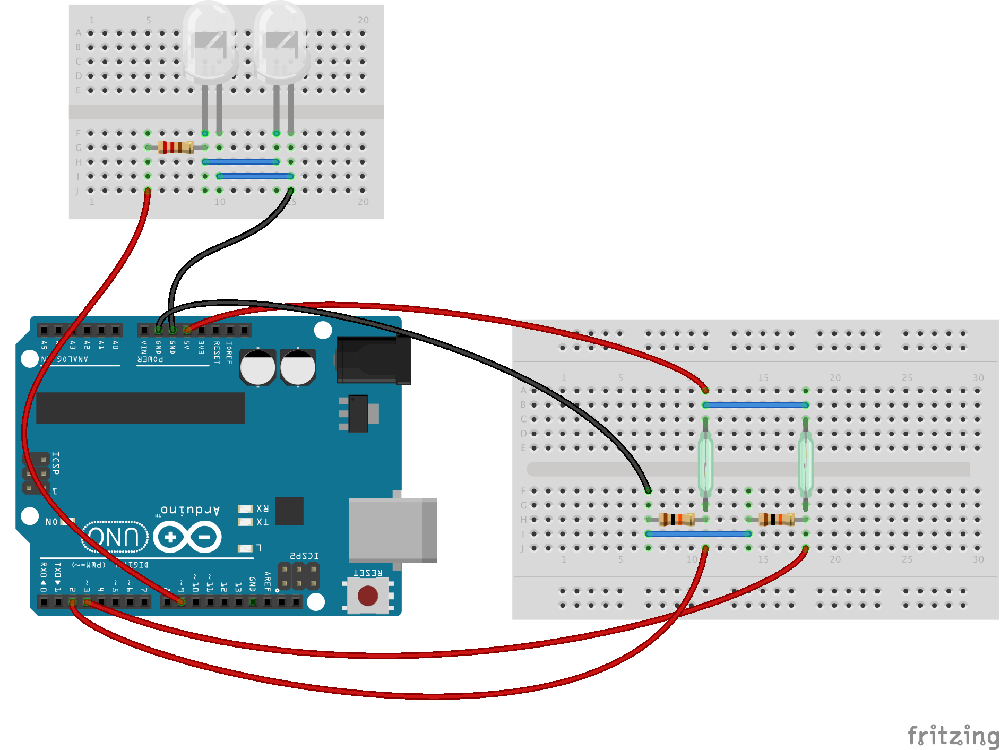

# Reed switch lab

Check out the presentation at [Speaker Deck](https://speakerdeck.com/moliveraf/reed-switches-and-arduino).

This lab shows how to use two reed switches wired to an Arduino board to control the brightness of an LED. The reed switches are separated by a known distance, which combined with the closing time of each switch, is used by Arduino to calculate the speed of the magnetic volume. Finally, Arduino uses it to set the brightness of the LED at the precise moment.

## Hardware

- Arduino Board
- (2) Reed switch (form A)
- (2) 10K ohm resistor
- Magnet
- (2) LED
- 220 ohm resistor

## Circuit

Two LEDs connected in parallel to pin 9 through a 220 ohm resistor. Two reed switches connected to pins 2 and 3.

## Schematic

